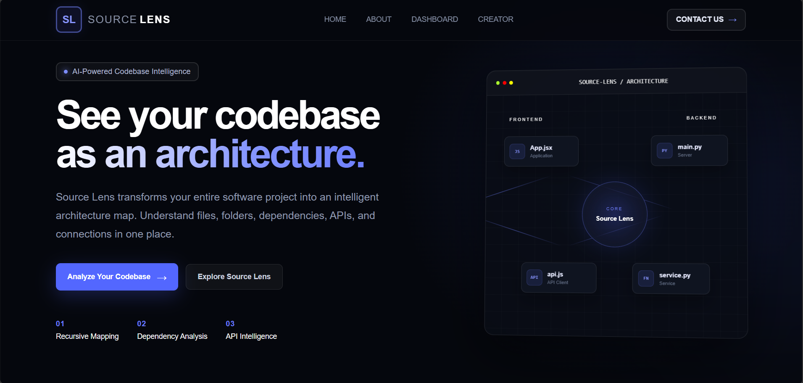

## 🏆 Hackathon Achievement

SourceLens was developed as a hackathon project to solve the challenge of
understanding large and complex codebases through visual code architecture.

### 📜 Certificate

### 📊 Source Lens Cover Page 

### 📊 Project Presentation Cover Page 

### 📊 Project Presentation  

